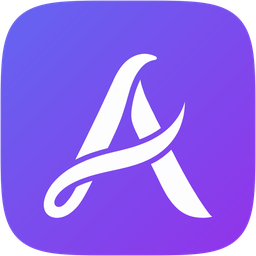
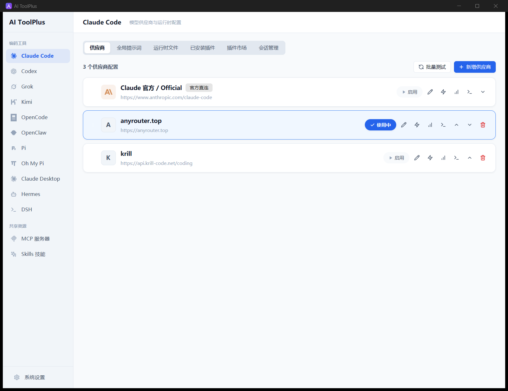
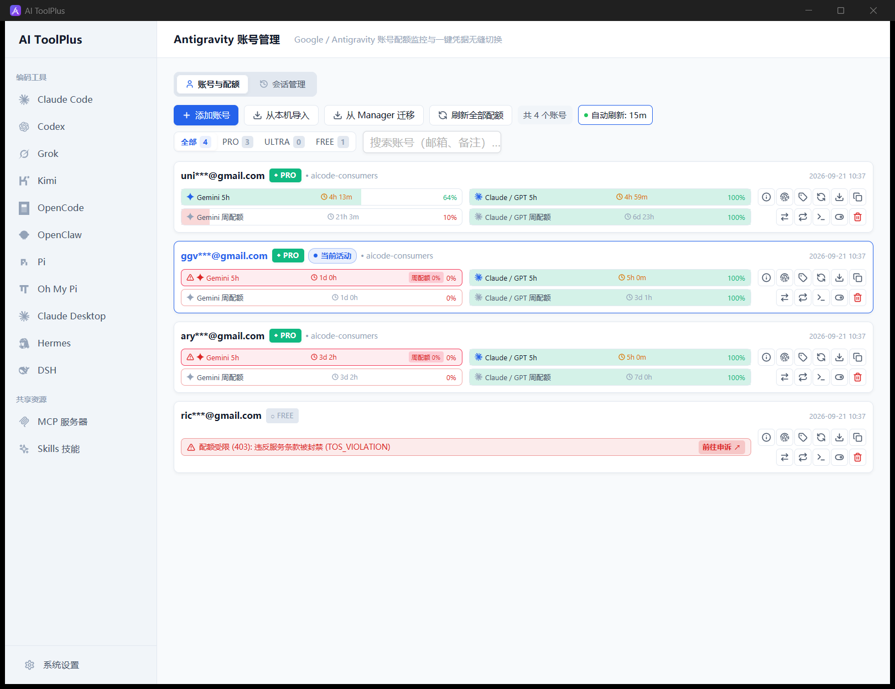
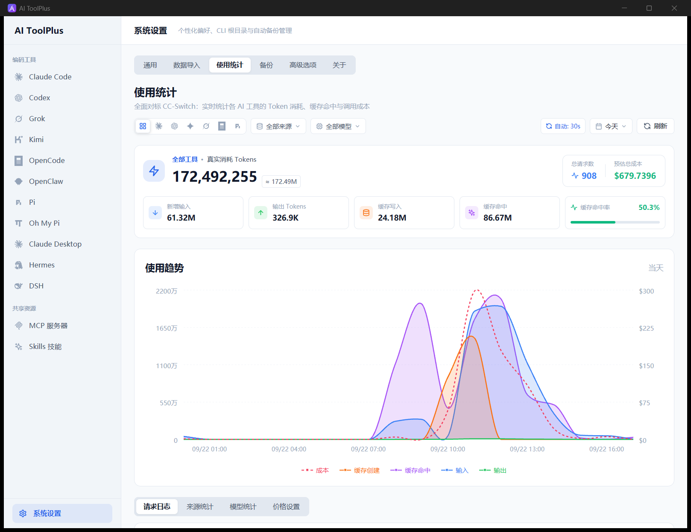
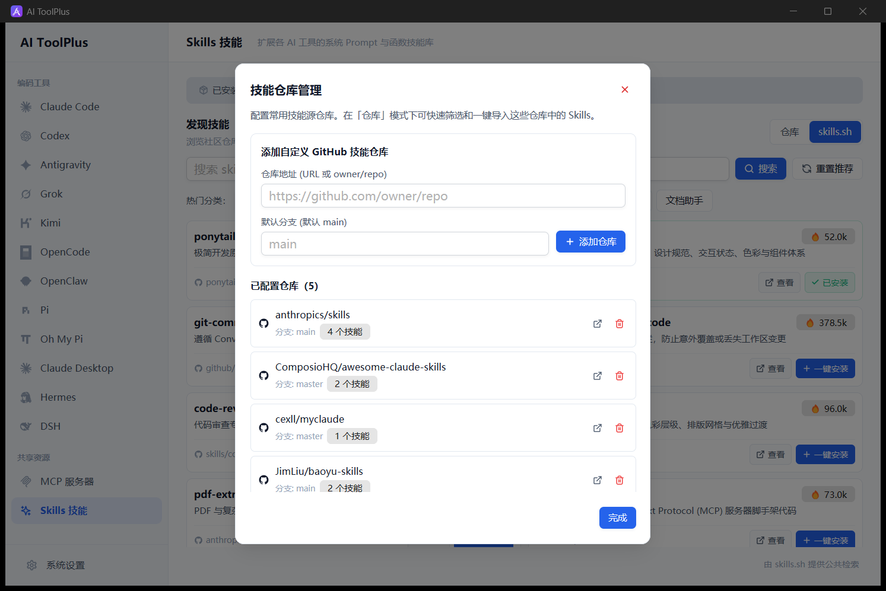
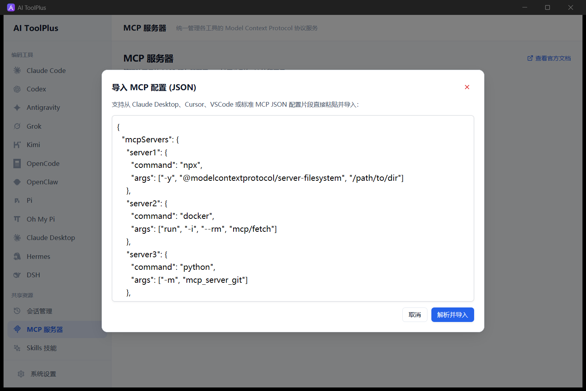
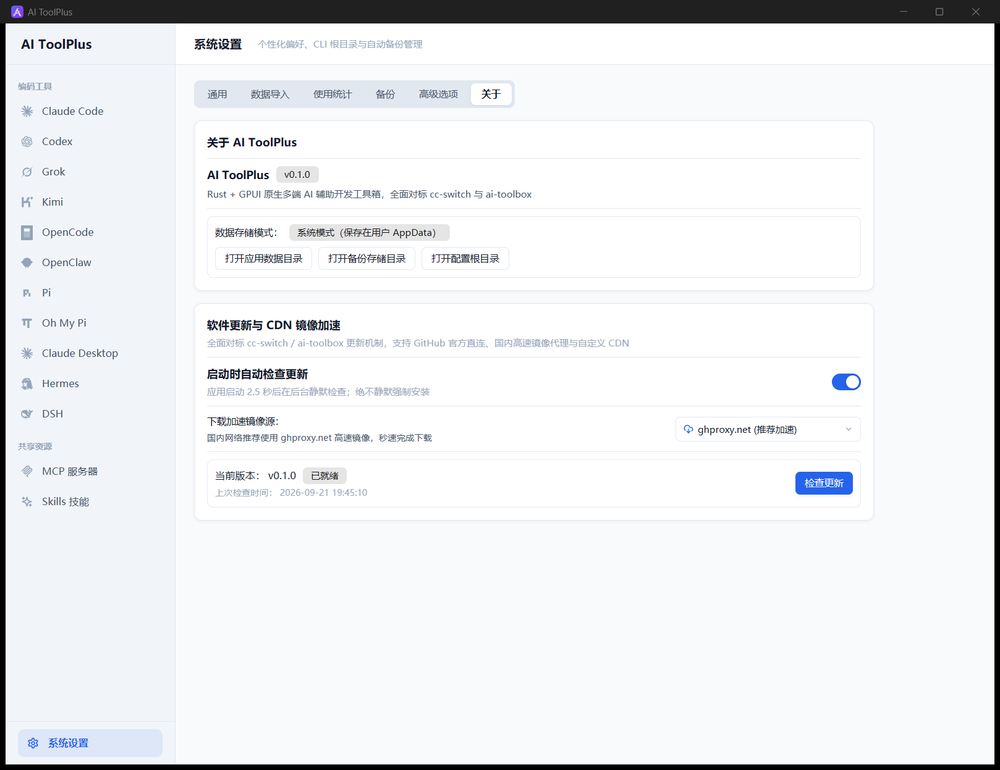

<div align="center">
  <p></p>
  <h1>AIToolPlus</h1>
  <p><strong>基于 Rust + GPUI 的高性能原生 AI 编程助手配置工作台与会话管理中心</strong></p>
  <p>原生 GPU 硬件加速渲染 · 毫秒级冷启动 · 极低内存开销 · 告别 Electron 与 WebView 臃肿卡顿</p>

  <p>
    <a href="https://github.com/821869798/aitoolplus/releases/latest"></a>
    <a href="https://github.com/821869798/aitoolplus/releases"></a>
    <a href="https://www.rust-lang.org/"></a>
    <a href="https://github.com/zed-industries/zed"></a>
    <a href="LICENSE"></a>
  </p>

  <p>
    <a href="./README.md">English</a> ·
    <a href="./README_ZH.md">简体中文</a> ·
    <a href="#下载与安装">下载与安装</a> ·
    <a href="#界面预览">界面预览</a> ·
    <a href="#主要特性">主要特性</a> ·
    <a href="#技术栈">技术栈</a> ·
    <a href="#开发与构建">开发与构建</a> ·
    <a href="#鸣谢">鸣谢</a> ·
    <a href="https://github.com/821869798/aitoolplus/releases/latest">最新发布</a>
  </p>

  <p></p>
</div>

`AIToolPlus` 是一款面向开发者的**原生高性能 AI 编程工具工作台**。深度解决多 AI 命令行工具（Claude Code、Codex、Gemini CLI、Pi、Grok、OpenCode 等）配置分散、切换繁琐、API 成本与 Token 无法直观监控、Antigravity 配额容易超限等痛点。

本项目采用纯 **Rust** 开发，基于 Zed 同款的 **GPUI Kit** 框架进行 GPU 原生渲染，具有极快的响应速度与极低的系统常驻资源占用。

---

## 涵盖的 AI 工具矩阵

`AIToolPlus` 原生集成并持续支持主流 AI 编程助手与扩展环境：

| AI 编程工具 / 环境 | 核心功能支持 |
| :--- | :--- |
| **Claude Code** | 提供商预设/切换、模型映射、Prompt 注入、插件管理、历史会话解析 |
| **Codex** | TOML 预设配置管理、模型重定向、插件生命周期与 MCP 联动 |
| **Gemini CLI** | Google AI 配置管理、环境变量与多端点速度测试 |
| **Grok** | 独立提供商管理、端点路由、会话树查看与缓存清理 |
| **Kimi** | Kimi 编程助手生态对接与配置同步 |
| **OpenCode / OpenClaw** | 提供商层级结构管理、Add-ons 本地桥接与预设应用 |
| **Pi / Oh My Pi (OMP)** | Extensions 本地扫描/保护、Model/Other 复合设置合并、多包保留 |
| **Claude Desktop** | 多 Profile 配置文件切换与原生配置监控 |
| **Hermes / DSH** | 记忆配置 (Memory Settings)、运行环境切换 |
| **Antigravity (专区)** | 多账号配额监控、Gemini 5小时/周配额、Claude/GPT 配额、周配额耗尽预警 |

---

## 下载与安装

> [!IMPORTANT]
> **官方渠道安全提示**：请务必通过官方 GitHub Releases 下载安装包。切勿运行任何来自第三方不可信来源的修改包，以确保您的 API 密钥与账号数据绝对安全。

### Windows 官方安装程序

前往 [GitHub Releases 最新发布页](https://github.com/821869798/aitoolplus/releases/latest) 下载官方安装程序：
- 文件名：`aitoolplus-setup.exe`
- 采用标准 NSIS 打包，内置安全静默升级与卸载支持。
- **支持应用内自动更新**：支持一键检查新版本，并内置国内高速 CDN 镜像加速下载。

---

## 界面预览

| 提供商管理与会话工作台 | Antigravity 多账号三列配额与耗尽预警 |
| :---: | :---: |
|  |  |
| **Token 用量统计与平滑成本走势图** | **Skills 技能商店与 Git 多仓库源管理** |
|  |  |
| **MCP 服务器管理与实时语法校验** | **应用更新与国内高速 CDN 镜像加速** |
|  |  |

---

## 主要特性

### 1. ⚡ 原生性能取向与极低资源开销
- **纯 Rust + GPUI Kit 渲染**：彻底抛弃基于 Electron 或 WebView 的庞大运行时依赖，启动时间小于 100 毫秒，常驻内存仅为传统工具的 $1/5$。
- **非阻塞异步调度**：基于 Tokio 与非阻塞 Channel 实现后台任务调度，配置监听、网络测速、用量同步与大文件扫描均在后台完成，界面永不掉帧。

### 2. 🛡️ Antigravity 专区：多账号配额管理与精细化预警
- **三列独立视觉架构**：
  - **第一列 (Gemini 配额)**：清晰展示 Gemini 5小时配额与当周配额进度条。
  - **第二列 (Claude / GPT 配额)**：展示多模型并行配额与重置倒计时。
  - **第三列 (操作区)**：一键快速切换账号、编辑、测速与状态刷新。
- **周配额耗尽深红预警**：实时追踪当周配额剩余比例，若当周配额为 0%，自动触发深红边框预警，防止关键任务因配额熔断中断。
- **灵活的导入生态**：同时支持 **Google 网页端 OAuth 自动化授权**、**RefreshToken 快速导入**，以及从现有 Antigravity 客户端一键无缝导入。

### 3. 📊 Token 用量统计与成本走势分析
- **对齐 CC-Switch 经典算法**：支持按天、周、月统计各提供商、模型的 Token 消耗、调用次数与费用。
- **平滑三次贝塞尔用量趋势曲线**：支持双击/悬停交互，精确浮窗提示每日具体模型用量明细；鼠标离开图表区域自动平滑销毁浮框。
- **模型价格倍率自定义**：内置官方默认计费标准，并支持用户针对各类 API 代理中转平台自定义价格倍率。
- **生态无缝导入**：支持一键读取导入 CC-Switch 的历史数据与 TokenRouter 数据库，无缝承接历史账单。

### 4. 🧩 MCP 服务与 Skills 技能商店
- **MCP 服务器管理**：支持一键开关与 JSON 语法高亮校验，提供可视化错误定位。
- **Skills 技能多源生态**：
  - 支持官方推荐技能市场、本地 ZIP 导入、以及通过 Git 托管的多仓库技能源（如 GitHub / Gitee / GitLab / 自建源）。
  - **Windows Junction 软链接**：集中存储库管理，一键软链接映射至 Claude Code、Codex 等各工具目录，修改实时生效无需重复复制。

### 5. 🚀 全自动热更新与国内 CDN 镜像加速
- **双模 API 适配**：同时兼容 GitHub Releases API 与轻量级 `latest.json` 清单。
- **一键切换国内镜像加速**：内置 `GitHub 官方`、`ghproxy.net (推荐)`、`mirror.ghproxy`、`gh-proxy.com` 以及自定义 CDN 前缀，国内用户无需配置翻墙代理即可享受 10~50 MB/s 高速更新。
- **EMA 指数平滑测速**：采用与 `ai-toolbox` 一致的移动均值测速算法，消除瞬时网络抖动，直观呈现真实下载进度与速率。
- **原子安全更新**：通过 SHA-256 校验并采用原子重命名，下载完成后一键拉起官方 NSIS 安装器无缝重启。

### 6. 🔒 数据安全、备份与云端同步
- **本地多版本快照**：支持一键创建本地全量备份，记录配置快照，随时按需回滚。
- **云端 WebDAV / 坚果云同步**：支持标准 WebDAV 协议远程备份与多端还原。
- **敏感数据保护**：API Key 等敏感机密默认通过操作系统底层安全数据保护接口（Windows DPAPI）安全加密存储。

---

## 技术栈

- **编程语言**：[Rust 2024 Edition](https://www.rust-lang.org/) (MSRV 1.91+)
- **UI 框架**：[GPUI Kit](https://github.com/zed-industries/zed) (基于 GPU 原生渲染的跨平台现代桌面界面系统)
- **异步运行时**：[Tokio](https://tokio.rs/) & [async-channel](https://crates.io/crates/async-channel)
- **网络与传输**：[Reqwest](https://crates.io/crates/reqwest) (连接池、流式分块、自定义代理支持)
- **数据序列化与配置**：[Serde](https://serde.rs/)、[serde_json](https://crates.io/crates/serde_json)、[toml_edit](https://crates.io/crates/toml_edit)
- **安全与加密**：[sha2](https://crates.io/crates/sha2)、[hmac](https://crates.io/crates/hmac)、Windows DPAPI
- **打包分发**：[NSIS (Nullsoft Scriptable Install System)](https://nsis.sourceforge.io/)

---

## 开发与构建

### 1. 环境准备

- 安装 [Rust 构建工具链](https://rustup.rs/)（建议 1.91 或更高版本）。
- Windows 环境需要安装带 C++ 支持的 Visual Studio Build Tools（MSVC）。
- 如需编译正式安装包，系统需已安装 [NSIS](https://nsis.sourceforge.io/)（并确保 `makensis` 位于 PATH 环境变量中）。

### 2. 运行与本地测试

```powershell
# 启动本地开发调试
cargo run -p aitoolplus

# 运行全工作区单元测试（231 个测试覆盖）
cargo test --workspace

# 代码质量与 Clippy 零警告校验
cargo clippy --workspace --all-targets -- -D warnings
```

### 3. 发布版本编译与打包

```powershell
# 编译 Release 高度优化二进制
cargo build --release

# 一键打包官方 Windows NSIS 安装程序（产物输出至 target/dist/aitoolplus-setup.exe）
powershell -ExecutionPolicy Bypass -File tools/build-installer.ps1
```

---

## 鸣谢

`AIToolPlus` 的诞生与迭代离不开开源社区的灵感启发与优秀先驱项目。特此向以下项目致以崇高的谢意：

- **[cc-switch](https://github.com/farion1231/cc-switch)**：由 farion1231 打造的极其出色的 Claude / Codex 提供商切换与用量统计工具。AIToolPlus 在提供商交互体验、Token 用量分析算法、数据导入格式规范等方面深受其优秀设计启发。
- **[ai-toolbox](https://github.com/coulsontl/ai-toolbox)**：由 coulsontl 主导的全方位多智能体桌面工作台。AIToolPlus 在多工具生命周期覆盖、平滑更新测速算法与统一桌面控制台理念上汲取了大量宝贵经验。

---

## 开源许可证

本项目基于 [GNU General Public License v3.0 或更高版本 (GPL-3.0-or-later)](./LICENSE) 协议开源。
